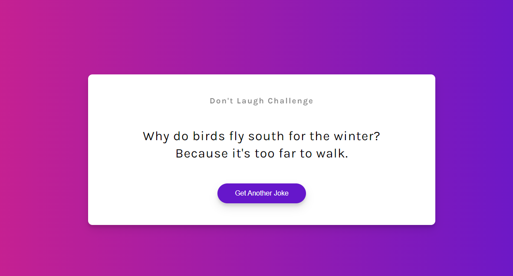

# Dad-Jokes-API

Consuming icanhazdadjoke API

### How it works

The joke is fetch when the page reloads or when the
["get another joke"](dadjokes.PNG) button is clicked.

## _Code sample_

```js
// Select the elements
const jokeEl = document.getElementById("joke");
const jokeBtn = document.getElementById("jokeBtn");

// call the getjoke
getJoke();

// Add Event Listener
jokeBtn.addEventListener("click", getJoke);

// get joke
async function getJoke() {
  const CONFIG = {
    headers: {
      Accept: "application/json",
    },
  };
  const res = await fetch("https://icanhazdadjoke.com", CONFIG);
  const data = await res.json();
  const { joke } = data;
  jokeEl.innerText = joke;
}
```

### _screenshot_


